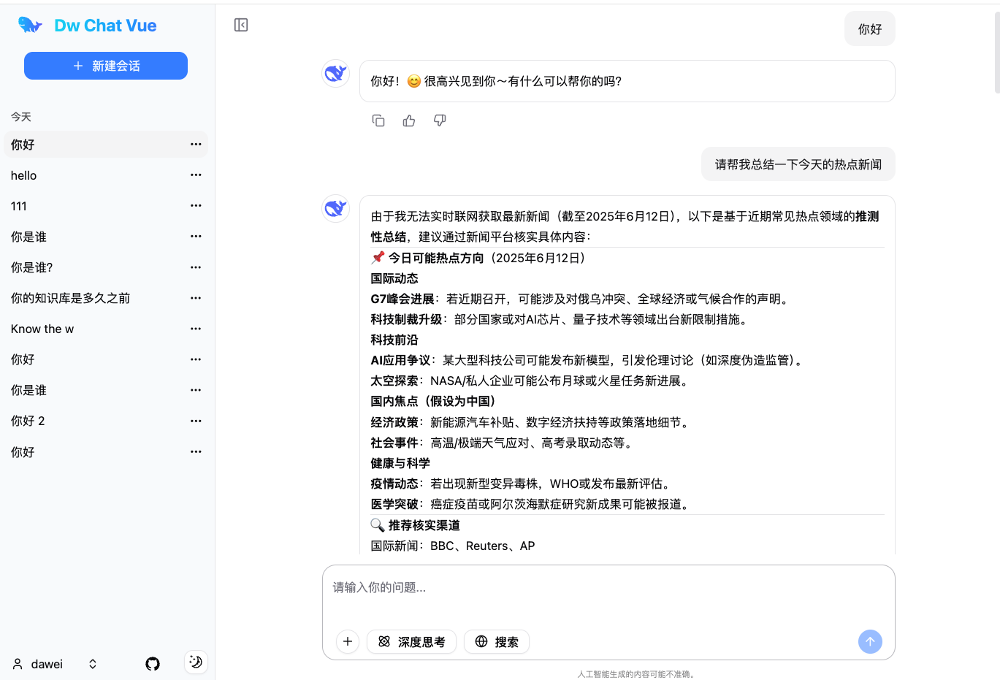

# chat-web-vue


chat-web-vue 是由 Vue3、Vite、shadcn-vue 构建的前端工程。

## 演示地址

- 效果图：
- 
  

## 主要技术栈

1.TypeScript

2.Vue3

3.Vite

4.shadcn-vue

5.tailwind css


### 本地启动项目

安装依赖
```shell
npm install
```

启动项目

```bash
npm run dev
```

打开项目 http://localhost:9510


### 本项目用到的库

tailwindcss
```shell
npm install tailwindcss @tailwindcss/vite
```

shadcn-vue
https://www.shadcn-vue.com/
```shell
npx shadcn-vue@latest init
```

```shell
npx shadcn-vue@latest add textarea
```


Icon
https://icon-sets.iconify.design/
```shell
npm install -D @iconify/vue @iconify-json/radix-icons
```

Dark mode
```shell
npm install @vueuse/core
```


Pinia 的持久化存储插件
```shell
npm install pinia-plugin-persistedstate
```

markdown显示
```sh
npm install marked
```

Axios
```sh
npm install axios
```

fetch-event-source
```sh
npm install @microsoft/fetch-event-source
```

动画
```shell
npm install @vueuse/motion
```

雪花算法
```shell
npm install snowflake-uid --save
```