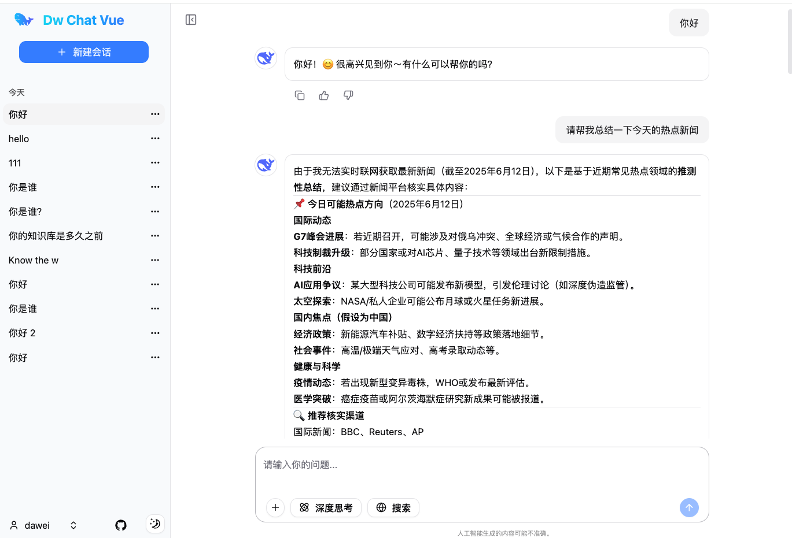

# dw-chat-web-vue

Dw Chat 是一个接入 DeepSeek 大模型的极简 AI 对话页面。

该项目 dw-chat-web-vue 是由 Vue3、Vite、shadcn-vue 构建的前端工程。

## 演示地址

- 网页演示地址：[https://dw-chat-vue.dw1898.top](https://dw-chat-vue.dw1898.top)
- 效果图：
- 
  

## 主要技术栈

1.TypeScript

2.Vue3

3.Vite

4.shadcn-vue

5.tailwind css


## 项目系列生态

Dw Chat 项目完整的生态包括以下项目版本：

| 工程名称             | 描述            | GitHub 地址                                     |
|------------------|---------------|-----------------------------------------------|
| dw-chat-web-lite | 纯前端版工程        | https://github.com/dawei1898/dw-chat-web-lite |
| dw-chat-web      | Next.js 前端工程  | https://github.com/dawei1898/dw-chat-web      |
| dw-chat-web-vue  | Vue3 前端工程     | https://github.com/dawei1898/dw-chat-web-vue  |
| dw-chat          | Java 后端工程     | https://github.com/dawei1898/dw-chat          |
| dw-chat-next     | Next.js 全栈版工程 | https://github.com/dawei1898/dw-chat-next     |
| dw-chat-nest     | NestJS 后端工程   | https://github.com/dawei1898/dw-chat-nest     |


### 本地启动项目

安装依赖
```shell
npm install
```

启动项目

```bash
npm run dev
```

打开项目 http://localhost:3000


### 本项目用到的库

tailwindcss
```shell
npm install tailwindcss @tailwindcss/vite
```

shadcn-vue
https://www.shadcn-vue.com/
```shell
npx shadcn-vue@latest init
```

```shell
npx shadcn-vue@latest add textarea
```


Icon
https://icon-sets.iconify.design/
```shell
npm install -D @iconify/vue @iconify-json/radix-icons
```

Dark mode
```shell
npm install @vueuse/core
```


Pinia 的持久化存储插件
```shell
npm install pinia-plugin-persistedstate
```

markdown显示
```sh
npm install marked
```

Axios
```sh
npm install axios
```

fetch-event-source
```sh
npm install @microsoft/fetch-event-source
```

动画
```shell
npm install @vueuse/motion
```

雪花算法
```shell
npm install snowflake-uid --save
```